University: [ITMO University](https://itmo.ru/ru/)  
Faculty: [FICT](https://fict.itmo.ru)  
Course: [Introduction to distributed technologies](https://github.com/itmo-ict-faculty/introduction-to-distributed-technologies)  
Year: 2022/2023  
Group: K4113c  
Author: Gavrilov Stepan Olegovich
Lab: Lab2  
Date of create: 11.12.2022  
Date of finished: 27.11.2022

# Лабораторная работа №2 "Развертывание веб сервиса в Minikube, доступ к веб интерфейсу сервиса. Мониторинг сервиса."

## Цель работы
Ознакомиться с типами "контроллеров" развертывания контейнеров, ознакомится с сетевыми сервисами и развернуть свое веб приложение.

---

## Ход работы

### Создание контейнера frontend-container
Скачиваем образ itdt-contained-frontend командой `docker pull ifilyaninitmo/itdt-contained-frontend:master`.

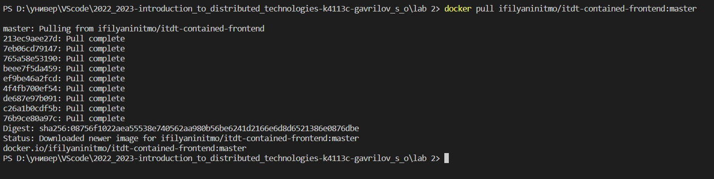

Проверяем, что появился образ itdt-contained-frontend - `docker images`.

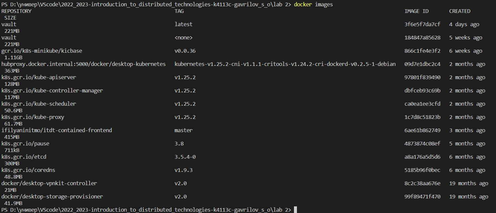

Создаем контейнер на основе образа itdt-contained-frontend - `docker run -d --name frontend-container ifilyaninitmo/itdt-contained-frontend:master`.

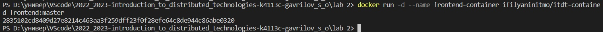

Проверяем, что появился контейнер frontend_container - `docker ps -a`.  

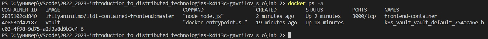

### Создание Deployment

Запускаем minikube - `minikube start`. 

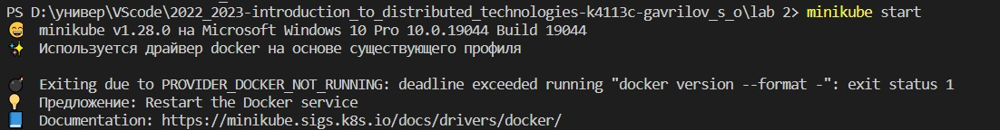

Чтобы запустить 2 экземпляра пода, используем свойства `replicas: 2`.

Шаблон пода задается в объекте `Template`. С помощью свойства `env` объявляем внутри подов переменные окружения `REACT_APP_USERNAME` и `REACT_APP_COMPANY_NAME` со значениями `Stepan` и `ITMO`, соответственно.

```yaml
apiVersion: apps/v1
kind: Deployment
metadata:
  name: frontend
  labels:
    app: frontend
spec:
  replicas: 2
  selector:
    matchLabels:
      app: frontend_pod
  template:
    metadata:
      labels:
        app: frontend_pod
    spec:
      containers:
      - name: frontend-container
        image: ifilyaninitmo/itdt-contained-frontend:master
        ports:
        - containerPort: 3000
        env:
        - name: REACT_APP_USERNAME
          value: Stepan
        - name: REACT_APP_COMPANY_NAME
          value: ITMO
```

Переходим в папку с .yaml файлом и выполняем команду `kubectl create -f frontend-deployment.yaml`.


### Создание сервиса frontend-service

Создаем сервис для доступа к развертыванию - `minikube kubectl -- expose deployment frontend --port=3000 --target-port=3000 --name=frontend-service --type=LoadBalancer`.

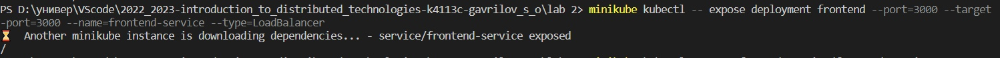


Пробрасываем локальный порт на порт контейнера - `minikube kubectl -- port-forward service/frontend-service 3000:3000`.

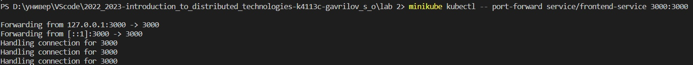


Открываем страницу `http://localhost:3000`.

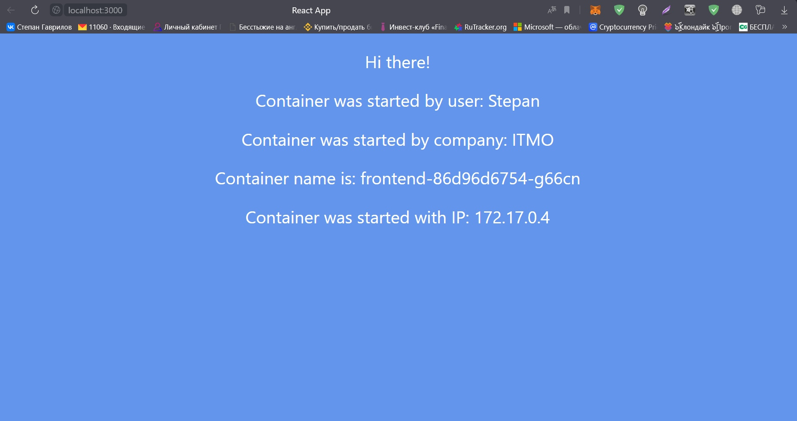


### Логи подов

Посмотрим список всех подов - `minikube kubectl get pods`. Как и должно было быть, deployment запустил 2 пода.

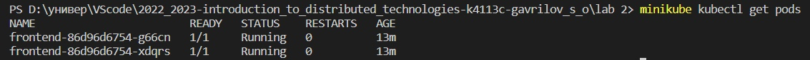


Смотрим логи первого пода 

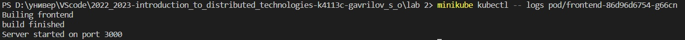


Смотрим логи второго пода

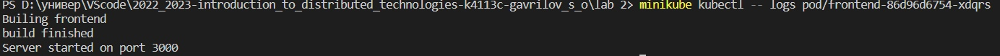


Чтобы удалить развертывание используем команду - `kubectl delete deployments/frontend`.

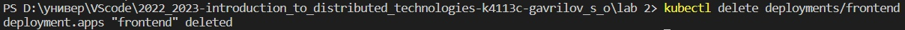


Проверяем - `kubectl get deployments` 

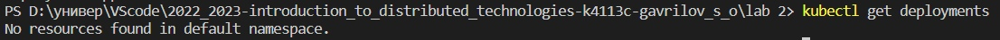

Останавливаем minikube командой `minikube stop`

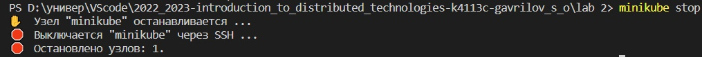


### Итог
С помощью deployment создали 2 пода на основе одного контейнера. Сервис типа LoadBalancer - эта абстракция, которая позволяет нам воспринимать группу подов (с одинаковой меткой) как единую сущность и работать с ними, используя сервис как единую точку доступа к ним.

    Именно поэтому логи первого и второго пода идентичны.

### Диаграмма
Схема организации контейнера и сервиса, нарисованная в [draw.io](https://app.diagrams.net/).

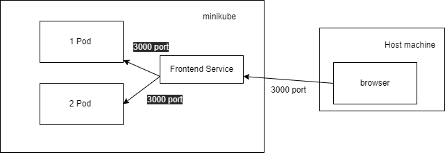