University: [ITMO University](https://itmo.ru/ru/)  
Faculty: [FICT](https://fict.itmo.ru)  
Course: [Introduction to distributed technologies](https://github.com/itmo-ict-faculty/introduction-to-distributed-technologies)  
Year: 2022/2023  
Group: K4113c  
Author: Gavrilov Stepan Olegovich
Lab: Lab3  
Date of create: 17.12.2022  
Date of finished: 27.11.2022

# Лабораторная работа №3 "Сертификаты и "секреты" в Minikube, безопасное хранение данных."

## Цель работы
Познакомиться с сертификатами и "секретами" в Minikube, правилами безопасного хранения данных в Minikube.


---
## Ход работы


Запускаем minikube
```
minikube start
```

Пример манифестов можно найти [тут](https://kubernetes.io/docs/concepts/configuration/configmap/).

```yaml
apiVersion: v1
kind: ConfigMap
metadata:
  name: frontend-configmap
data:
  react_app_user_name: "stepan"
  react_app_company_name: "ITMO"
```
Прописывем необходимые значения в ключах `react_app_user_name` и `react_app_company_name` 

Выполняем команду 
```
kubectl create -f frontend-configmap.yaml
```
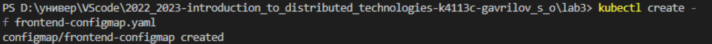

Проверяем, что появился ConfigMap - `kubectl get configmaps`.

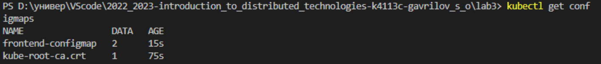


### Создание ReplicaSet
[Официальная документация](https://kubernetes.io/docs/concepts/workloads/controllers/replicaset/).

```yaml
apiVersion: apps/v1
kind: ReplicaSet
metadata:
  name: frontend-replicaset
  labels:
    app: lab3-frontend
spec:
  replicas: 2
  selector:
    matchLabels:
      app: lab3-frontend
  template:
    metadata:
      labels:
        app: lab3-frontend
    spec:
      containers:
      - name: frontend-container
        image: ifilyaninitmo/itdt-contained-frontend:master
        ports:
        - containerPort: 3000
        env:
        - name: REACT_APP_USERNAME
          valueFrom:
            configMapKeyRef:
              name: frontend-configmap
              key: react_app_user_name
        - name: REACT_APP_COMPANY_NAME
          valueFrom:
            configMapKeyRef:
              name: frontend-configmap
              key: react_app_company_name
```


Создаем контроллер командой 
```
kubectl create -f frontend-replicaset-manifest.yaml
```

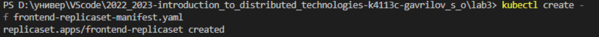


Проверяем 
```
kubectl get rs
```

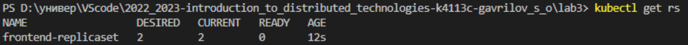

### Создание сервиса
[Официальной документации](https://kubernetes.io/docs/concepts/services-networking/service/)

```yaml
apiVersion: v1
kind: Service
metadata:
  name: frontend-service
  labels:
    app: lab3-frontend
spec:
  type: NodePort
  selector:
    app: lab3-frontend
  ports:
    - protocol: TCP
      port: 3000
      targetPort: 3000
      nodePort: 30333
```

Из диапазона 30000–32767 выбираем номер порта `nodePort` 30333. 

В поле `type` можем указать `NodePort` или `LoadBalancer`

Создаем сервис 
```
kubectl create -f frontend-service.yaml
```

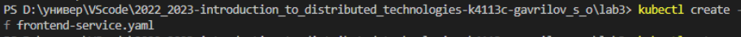

Проверяем 
```
kubectl get services
```

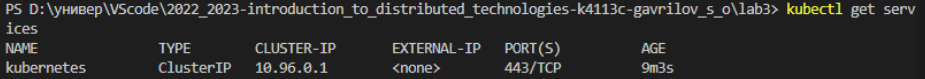

### Генерация TLS
Для генерации TLS сертификата будем использовать инструмент командной строки [OpenSSL](https://losst.pro/sozdanie-sertifikata-openssl). 

ОБЯЗАТЕЛЬНО добавляем в [переменную среды PATH](https://lumpics.ru/environment-variables-in-windows-10/) путь к bin папке, по сути следуем [инструкции](https://stackoverflow.com/questions/50625283/how-to-install-openssl-in-windows-10).

Генерируем приватный ключ 

```
openssl genrsa -out lab3.key 2048
```

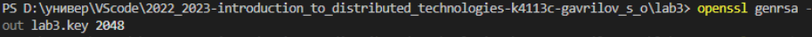

Для того чтобы получить сертификат, который можно использовать нужно этот ключ подписать. А для этого надо создать запрос на подпись.

Создаём запрос на подпись

```
openssl req -key lab3.key -new -out lab3.csr
```


При создании запроса на подпись нужно указать необходимую информацию.

Подписываем сертификат

```
openssl x509 -signkey lab3.key -in lab3.csr -req -days 30 -out lab3.crt`
```
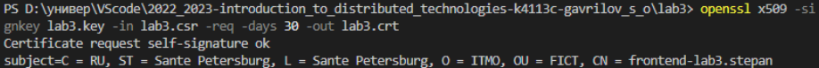

### Создание Secret
Создаем секрет 
```
kubectl create secret tls lab3-tls --cert=lab3.crt --key=lab3.key
```

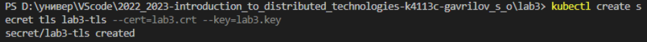

### Создание Ingress

Подключаем Ingress в minikube:

```
minikube addons enable ingress
```
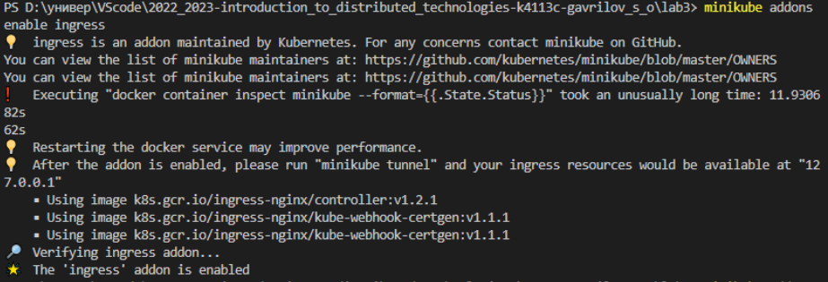
```
minikube addons enable ingress-dns
```
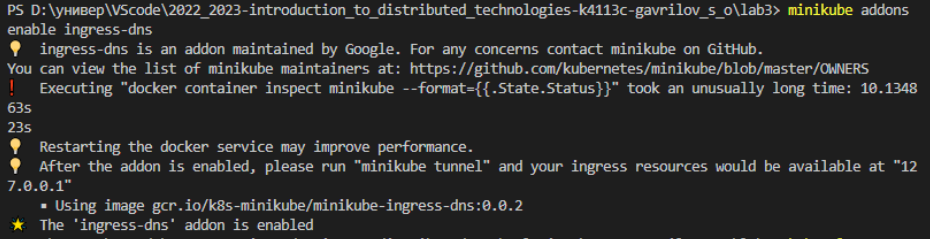

Манифест для Ingress пишем по шаблону из [официальной документации](https://kubernetes.io/docs/concepts/services-networking/ingress/).

```yaml
apiVersion: networking.k8s.io/v1
kind: Ingress
metadata:
  name: frontend-ingress
spec:
  tls:
  - hosts:
      - frontend-lab3.stepan
    secretName: lab3-tls
  rules:
  - host: frontend-lab3.stepan
    http:
      paths:
      - path: /
        pathType: Prefix
        backend:
          service:
            name: frontend-service
            port:
              number: 3000
```


 Добавляем `127.0.0.1 frontend-lab3.stepan` в хост файл

Создаем точку входа в кластер minikube
```
kubectl create -f frontend-ingress.yaml
```

Проверяем
```
kubectl get ingress
```

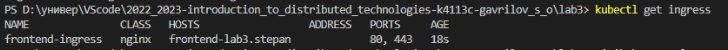

Подключаемся к Ingress 
``` 
minikube tunnel
```

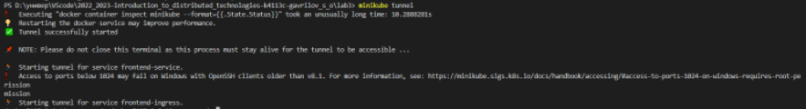

Открываем страницу - `https://frontend-lab3.stepan`.

Видим параметры:

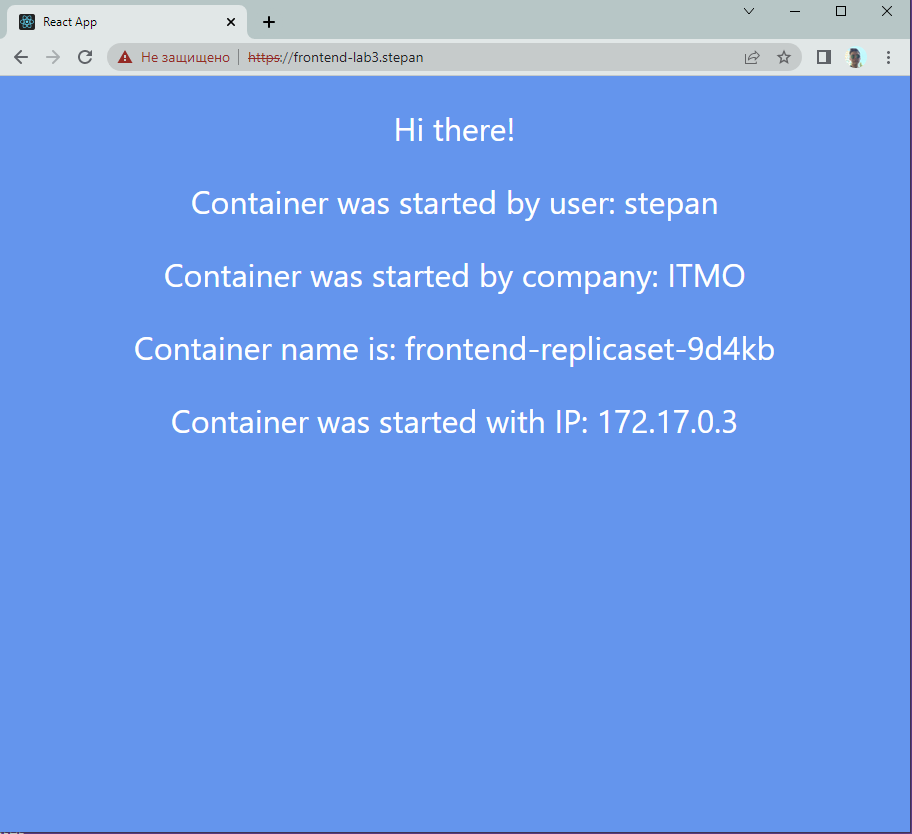


### Диаграмма


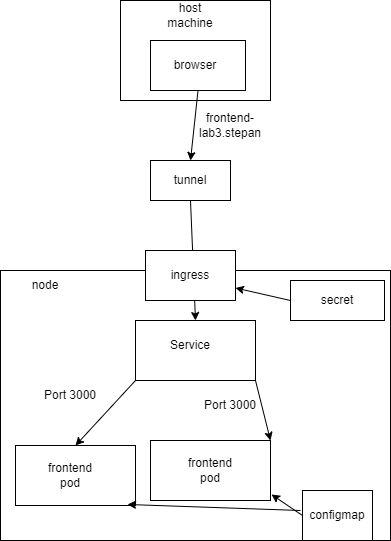


