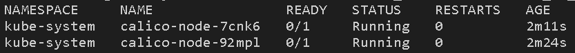
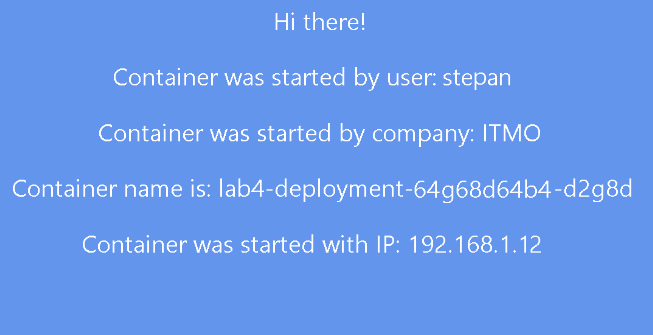

University: [ITMO University](https://itmo.ru/ru/)  
Faculty: [FICT](https://fict.itmo.ru)  
Course: [Introduction to distributed technologies](https://github.com/itmo-ict-faculty/introduction-to-distributed-technologies)  
Year: 2022/2023  
Group: K4113c  
Author: Gavrilov Stepan Olegovich
Lab: Lab4  
Date of create: 29.12.2022  
Date of finished: 27.11.2022

# Лабораторная работа №4 "Сети связи в Minikube, CNI и CoreDNS"


## Цель работы
Познакомиться с CNI Calico и функцией IPAM Plugin, изучить особенности работы CNI и CoreDNS.


---
## Ход работы

При запуске minikube сразу устанавливаем `CNI=calico`, в режиме `Multi-Node Clusters` для развёртывания 2 нод

```
minikube start --network-plugin=cni --cni=calico --nodes 2 -p multinode-demo
```

Проверяем ноды
```
 kubectl get nodes
```


Проверяем работу CNI Calico, смотрим Pod'ы с меткой calico-node
```
kubectl get pods -l k8s-app=calico-node -A
```



### calicoctl и IPPool
Назначаем IP адреса в Calico    
```
kubectl label nodes multinode-demo zone=east  
kubectl label nodes multinode-demo-m02 zone=west
```

[Шаблон манифеста IPPool](https://projectcalico.docs.tigera.io/networking/assign-ip-addresses-topology) берем из официальной документации Calico:

```yaml
apiVersion: projectcalico.org/v3
kind: IPPool
metadata:
   name: zone-east-ippool
spec:
   cidr: 192.168.0.0/24
   ipipMode: Always
   natOutgoing: true
   nodeSelector: zone == "east"
---
apiVersion: projectcalico.org/v3
kind: IPPool
metadata:
   name: zone-west-ippool
spec:
   cidr: 192.168.1.0/24
   ipipMode: Always
   natOutgoing: true
   nodeSelector: zone == "west"
```

Чтобы применить манифест для IPPool, надо установить **calicoctl**, для этого скачаем [config-файл](https://github.com/projectcalico/calico/blob/master/manifests/calicoctl.yaml) с официального репозитория и выполним команду: `kubectl create -f calicoctl.yaml`.

 


Удаляем IPPool по-умолчанию:
```
kubectl delete ippools default-ipv4-ippool
```


Создаем IPPool через командную строку (VS code выфдаёт ошыбку):
```
kubectl exec -i -n kube-system calicoctl -- /calicoctl --allow-version-mismatch create -f - < lab4-ippool.yaml
```


Проверяем pool:
```
kubectl exec -i -n kube-system calicoctl -- /calicoctl --allow-version-mismatch get ippool -o wide
```


### Deployment и Service
Пишем манифест

```yaml
apiVersion: v1
kind: Service
metadata:
  name: lab4-service
spec:
  selector:
    app: lab4-frontend
  ports:
    - port: 3000
      targetPort: 3000
  type: LoadBalancer
```

```
kubectl apply -f lab4-deployment.yaml -f lab4-service.yaml
```

Проверяем

```
kubectl get deployments
```

```
kubectl get services
```


Проверяем IP созданных Pod'ов: 
```
kubectl get pods -o wide
```


Пробрасываем порт  
```
kubectl port-forward service/lab4-service 8200:3000
```

Проверяем в браузере



### Пингуем

```

kubectl exec -ti lab4-deployment-64g68d64b4-d2g8d -- sh
```


Выходим с помощью 
``` 
exit
```
```

kubectl exec -ti lab4-deployment-64g68d64b4-ct1hf -- sh
```


### Диаграмма


